Problem 7: {string s| s ends with  10 }

1. NFA:

   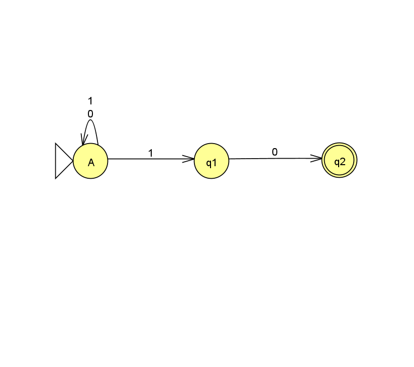

2. Batch test strings:

   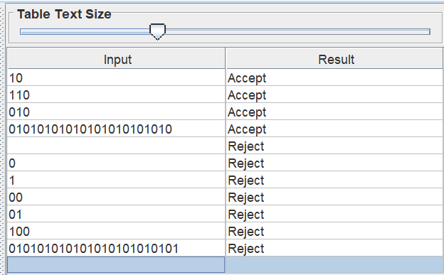

3. The challenging string was 10110 because there a multiple places where the machine can start reading the expected end of the string.

Manual NFA computation:
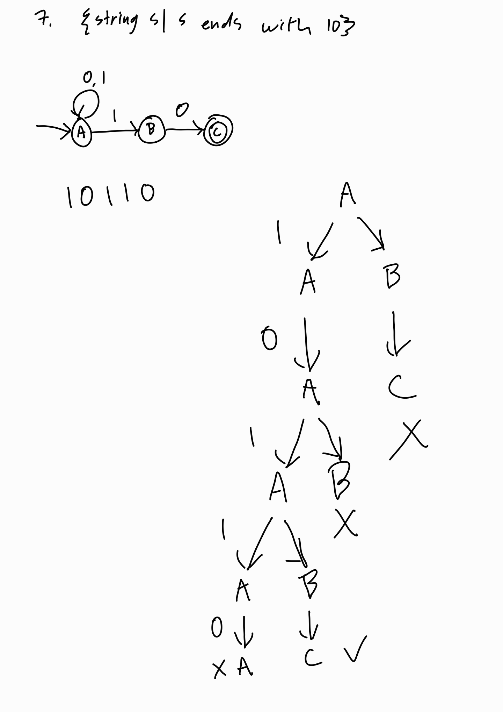

Computation via JFLAP Step with Closure:
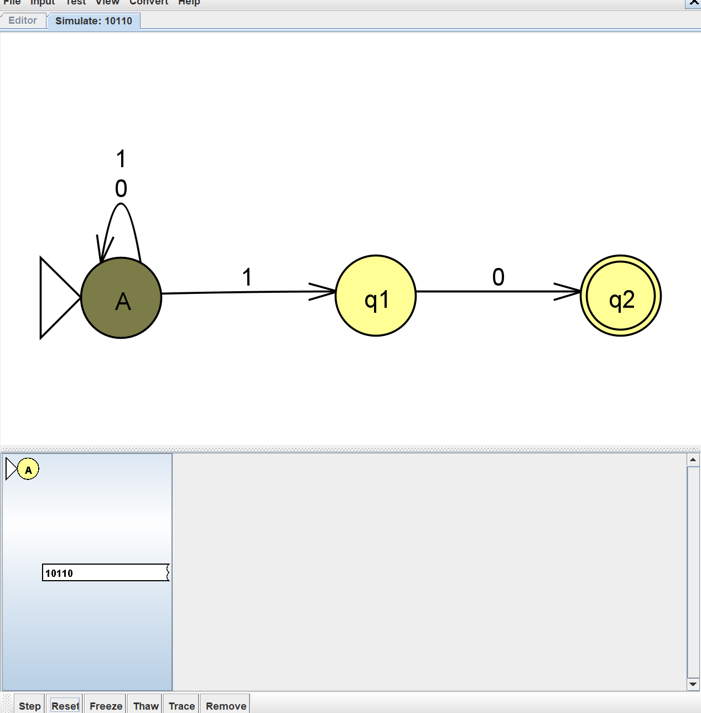

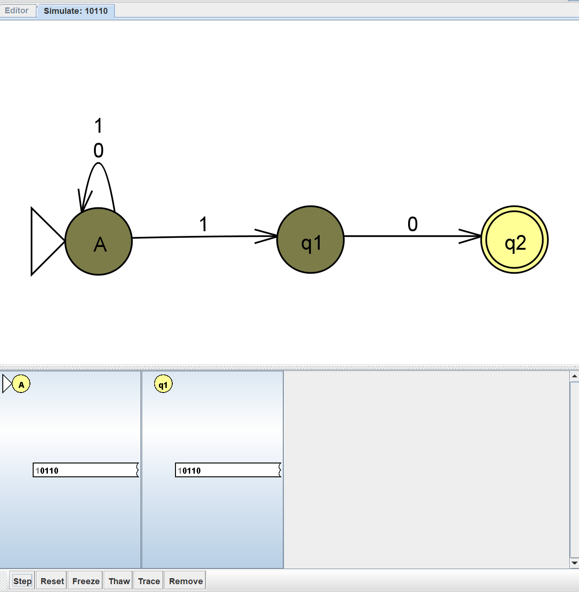

	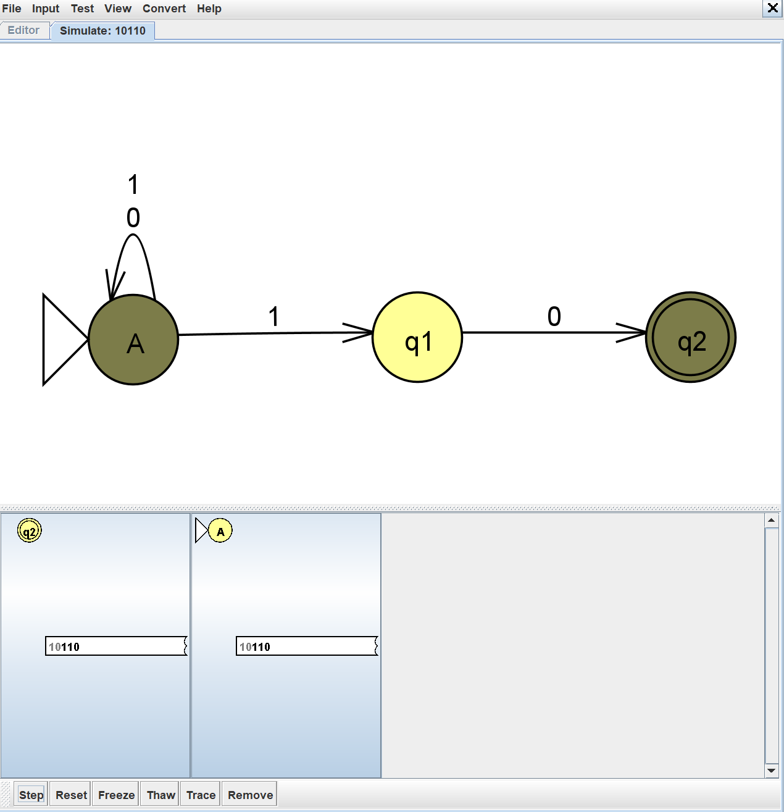

	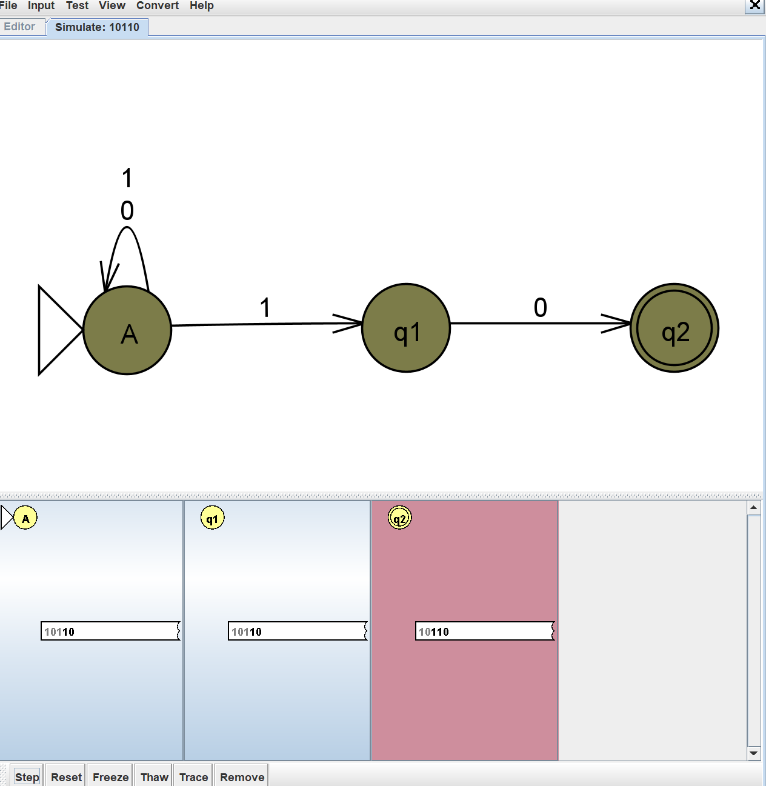

	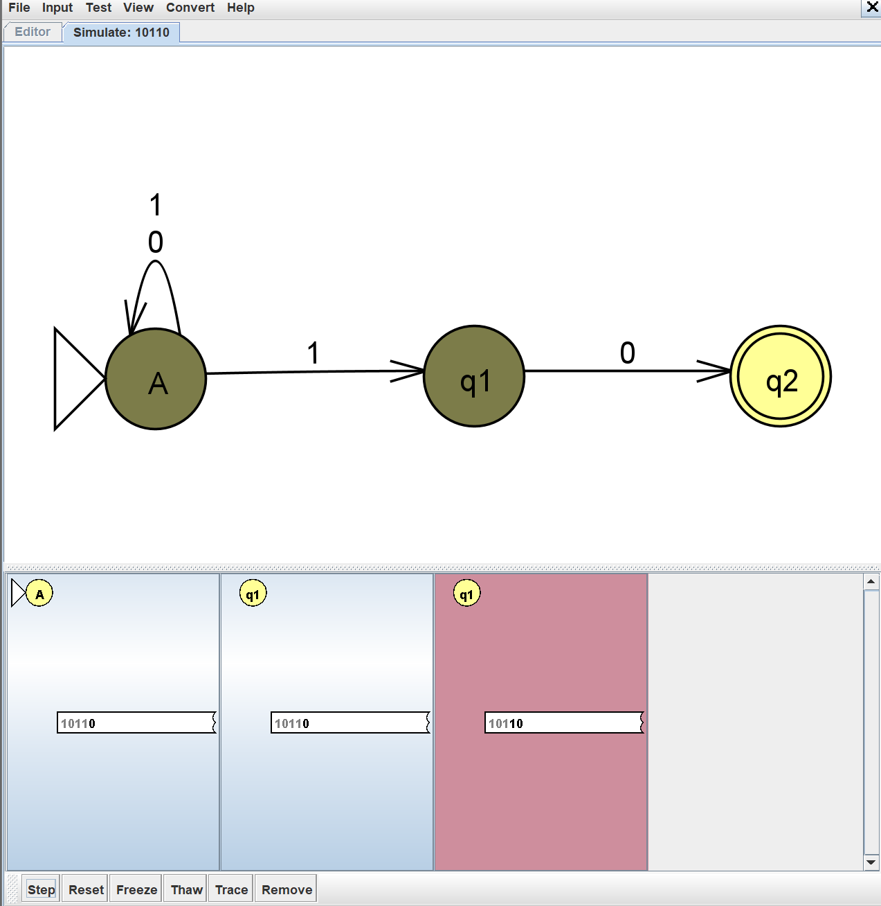

	

	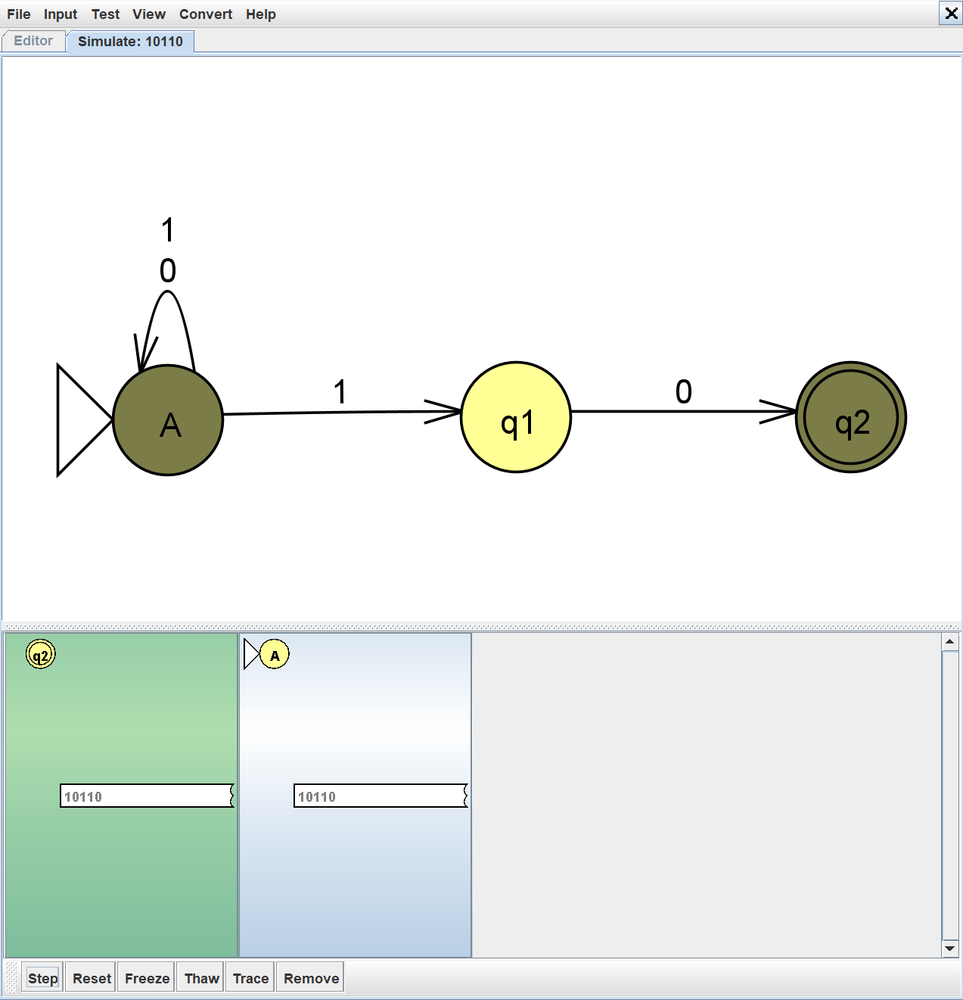

	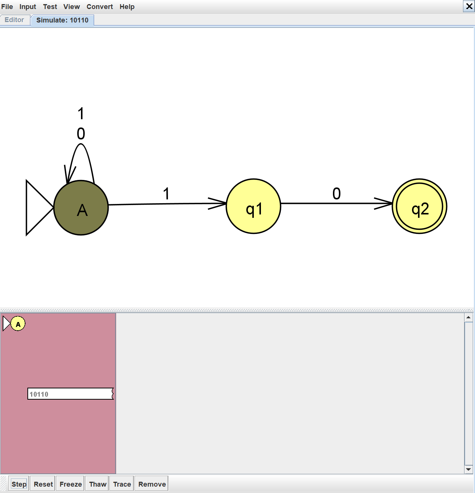

	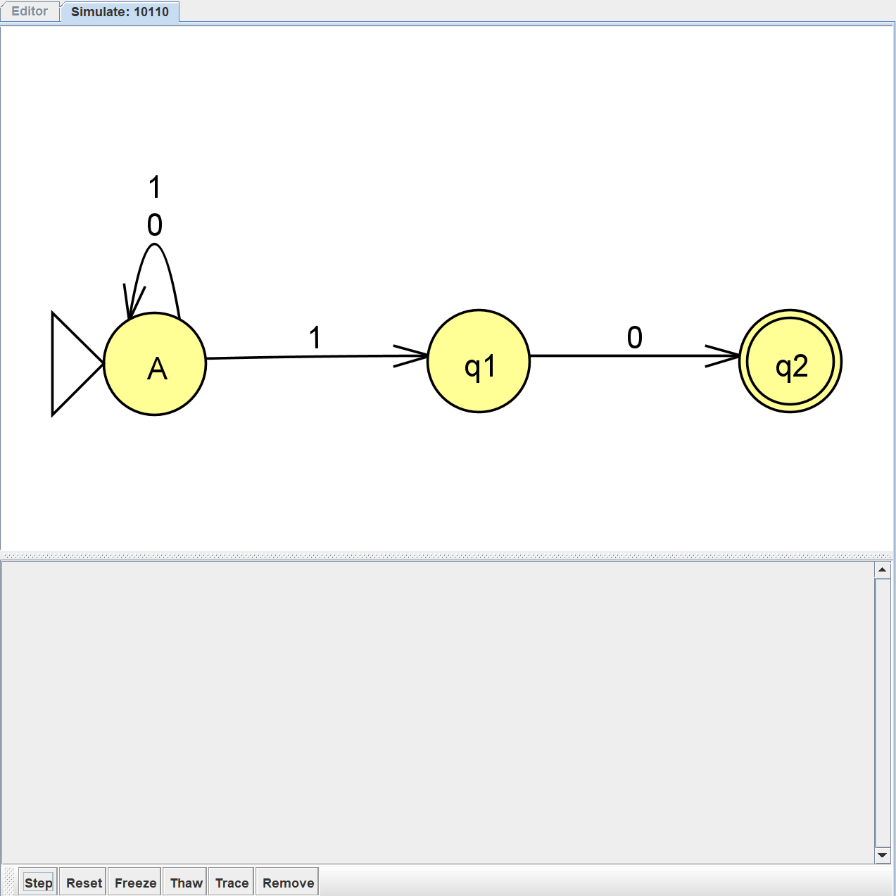

