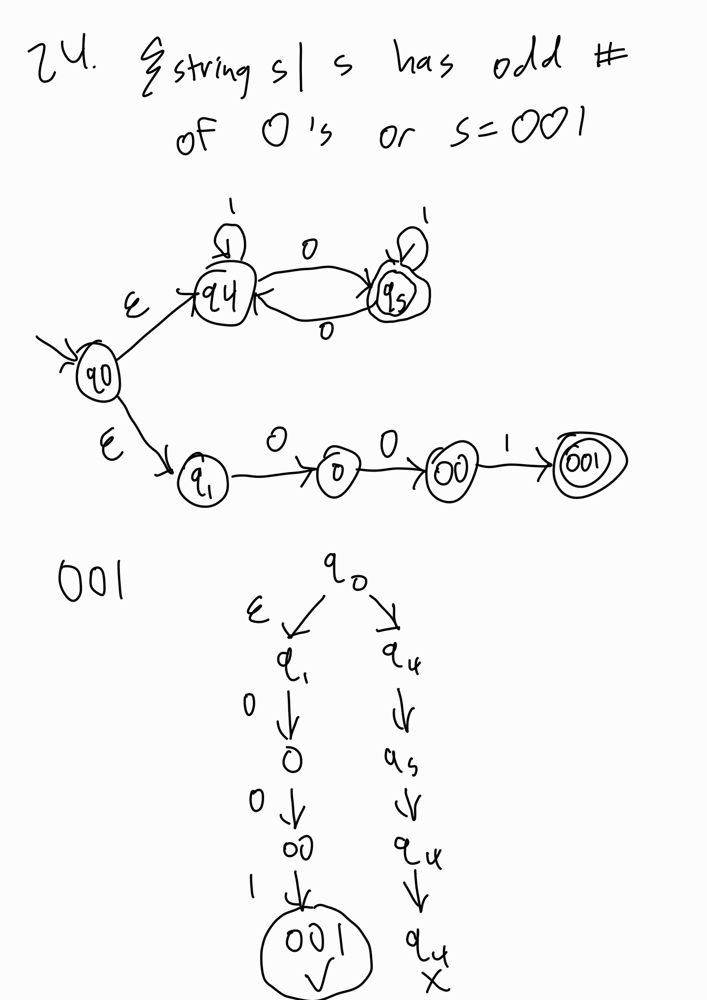
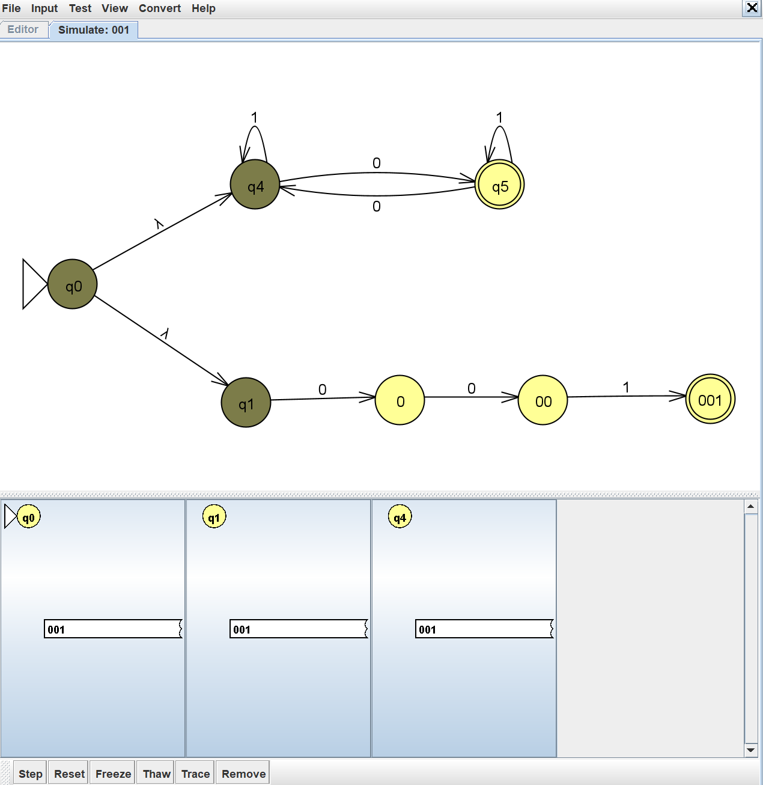
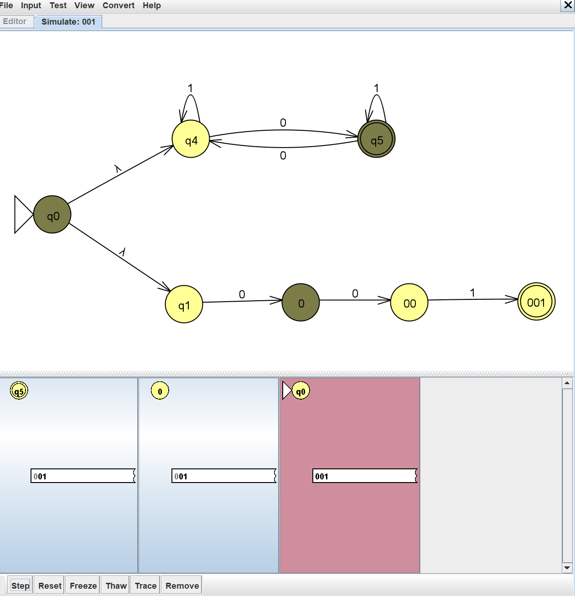
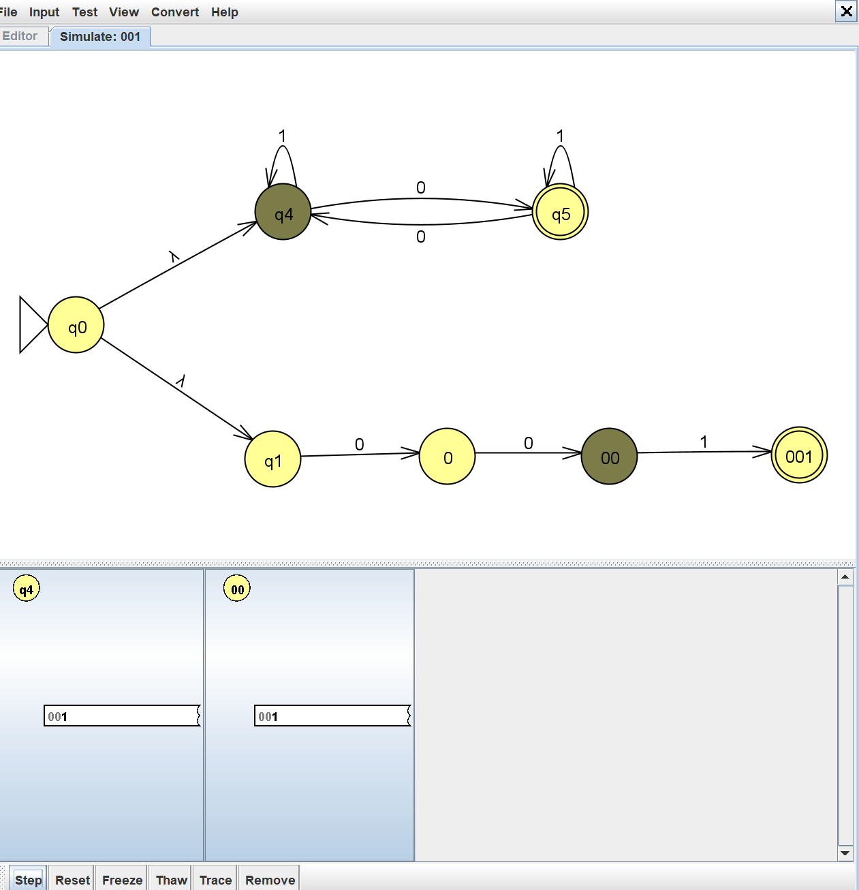
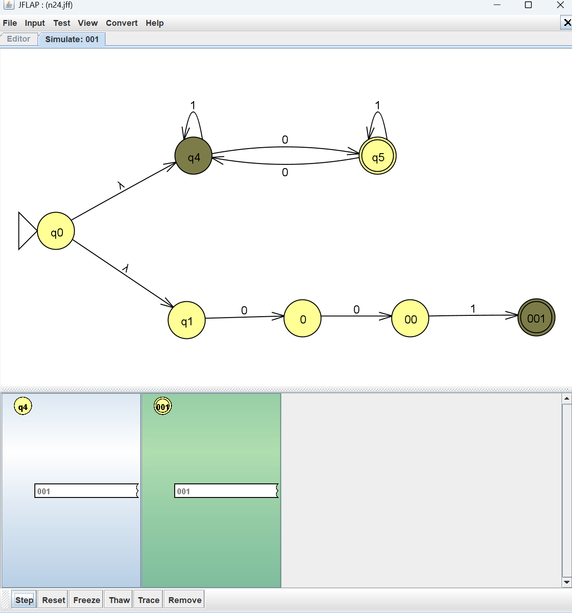
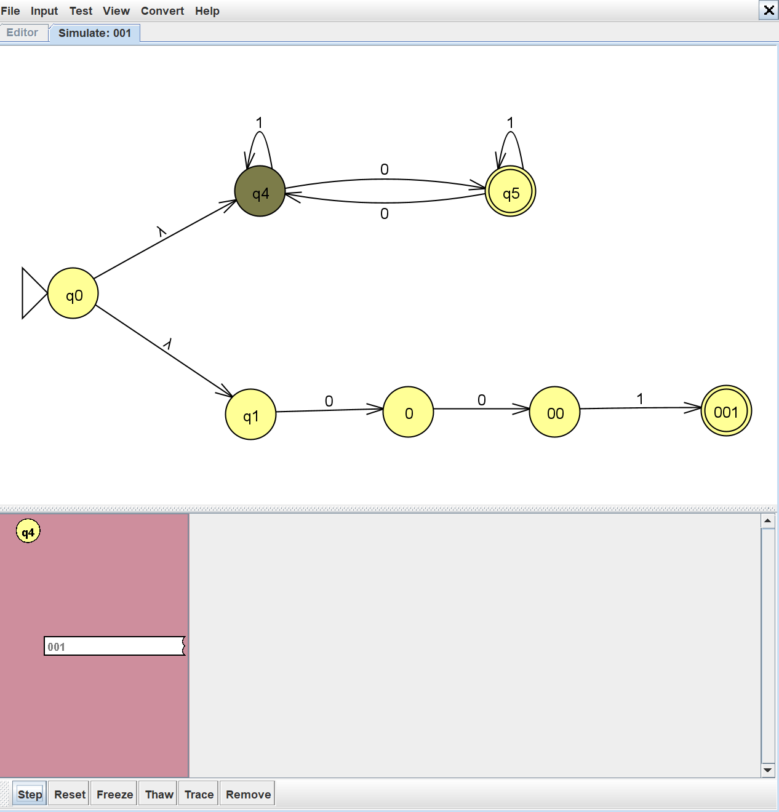
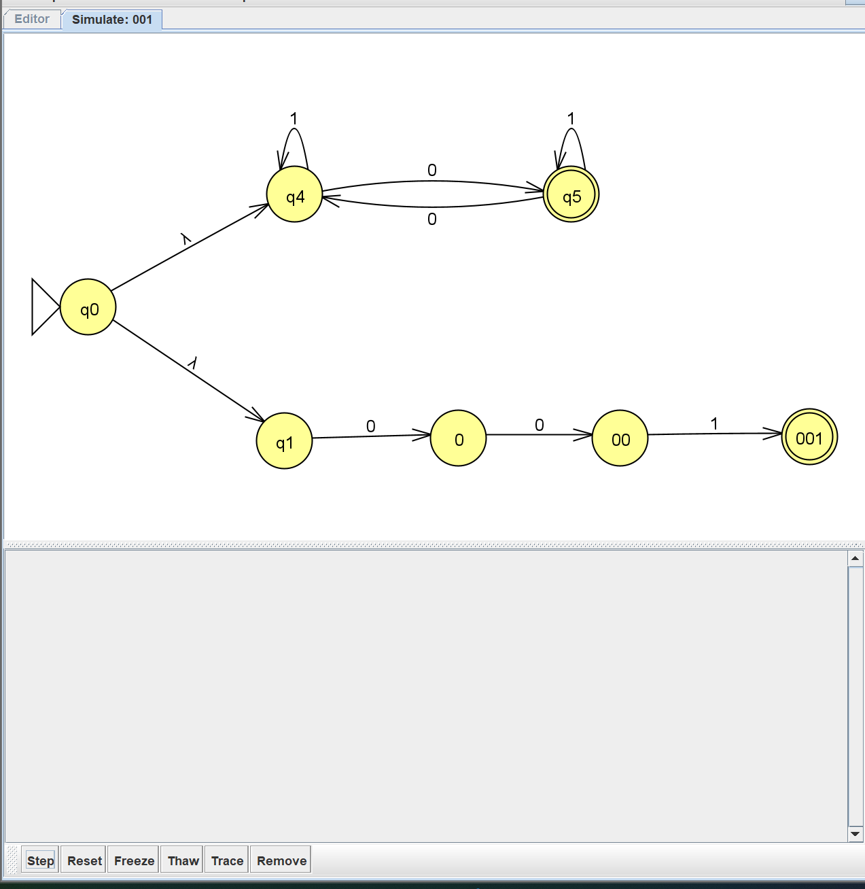

Problem 24: {string s| s has odd # of 0's or s=001}

1. NFA:

	

2. Batch test strings:

	

3. The challenging string was 001 because the branch for odd # of 0's fails, but the branch where s=001 succeeds.

	Manual NFA computation:

	

	Computation via JFLAP Step with Closure:
	

	

	

	

	

	

